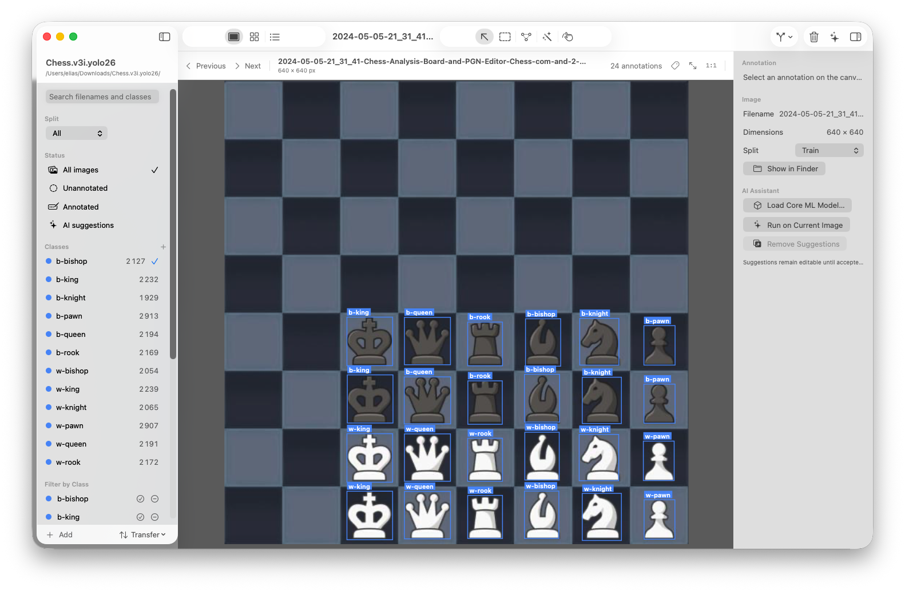
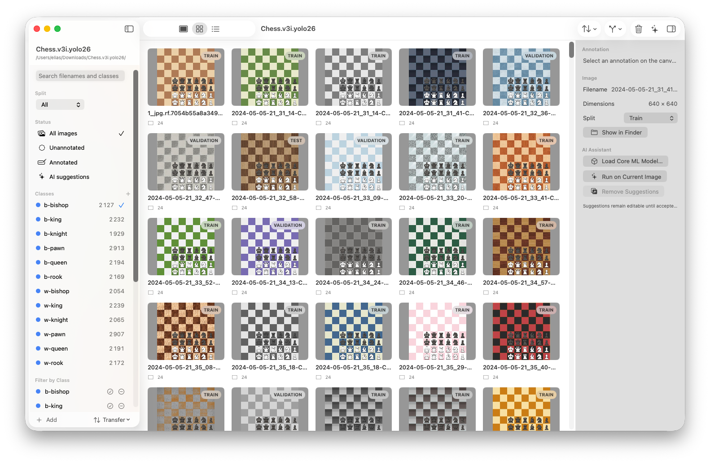
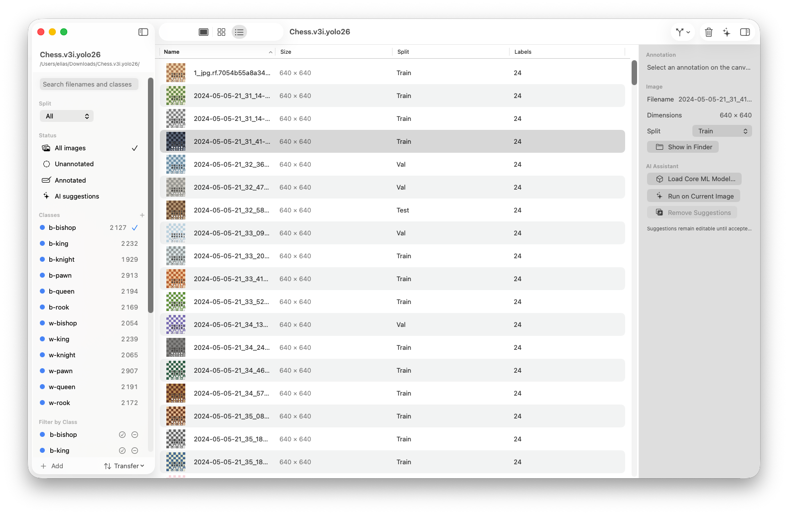
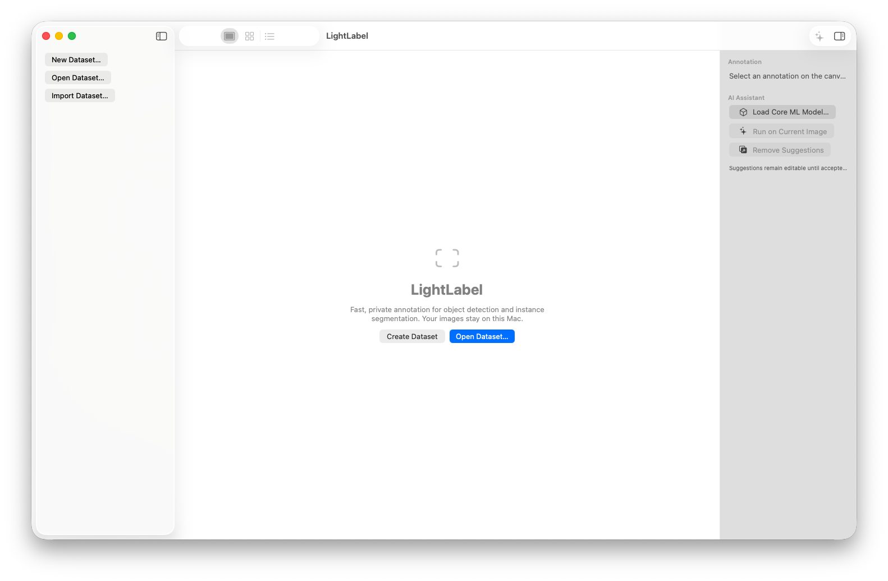

# LightLabel

LightLabel is a native macOS application for preparing object-detection and instance-segmentation datasets. It is written in Swift with SwiftUI, AppKit where desktop input needs it, and Apple frameworks for images and local inference. The design is offline-first: dataset images, annotations, project state, and models remain on the Mac.

The repository contains the complete format-independent domain model, geometry transforms, YOLO and COCO format code, dataset validation, atomic JSON persistence, bounded image loading, Core ML/Vision inference adapters, and a native three-column annotation interface.

## Screenshots

These screenshots are from the current native macOS app build.

### Workspace



*Annotate images with bounding boxes and polygons while browsing the dataset sidebar and inspector.*

### Grid



*Browse thumbnails, split badges, and annotation counts at a glance.*

### List



*Use Finder-style columns for filename, dimensions, split, and label counts.*

### Welcome screen



*Create, open, or import a local dataset from the welcome screen.*

## Download

For Apple Silicon Macs, download the latest Release build:

[Download LightLabel for macOS arm64](https://github.com/pigeonmal/LightLabel/releases/latest/download/LightLabel-macOS-arm64.zip)

The app runs locally and does not require an account or a cloud service. The app is locally signed but not notarized, so macOS may ask you to confirm the first launch because the build is distributed directly from GitHub.

## Features

- Normalized bounding boxes and polygons in a format-independent model
- Object-detection and polygon-segmentation geometry
- Aspect-fit/aspect-fill image-to-canvas transforms
- YOLO detection and segmentation import/export
- COCO bounding-box and polygon import/export
- Dataset validation for category, image, reference, and geometry errors
- Stable deterministic identifiers for imported records
- Debounced, atomic project JSON persistence with automatic source-format synchronization
- Lazy ImageIO image and thumbnail decoding
- Native SwiftUI browser, workspace, sidebar, inspector, menus, and shortcuts
- Finder-style sorting, multi-selection, bulk split changes, and bulk Trash actions in grid/list views
- Per-image tags with quick creation, multi-image assignment, filtering, and import provenance tags
- SAM2 Tiny Smart Polygon clicks using on-device Core ML masks, with crop-first prompts for small objects
- Smart splitting that groups visually similar images and balances class distribution across splits
- New-dataset format selection with automatic YOLO or COCO synchronization
- Nested COCO discovery and image-copying dataset merge/import
- Local Core ML inference through Vision recognized objects or a configurable raw YOLO tensor decoder
- Confidence filtering and class-aware or class-agnostic non-maximum suppression
- On-device SAM2 runtime through the Apache-2.0 SamKit Swift package; no network inference

## Requirements

- Apple Silicon Mac
- macOS 15 or later
- Xcode with a Swift 6-compatible macOS SDK
- No network service or account

The expected project is `LightLabel.xcodeproj` with the `LightLabel` scheme.

## Quick start

1. Download and unzip the latest arm64 release.
2. Open `LightLabel.app` and choose **Create Dataset**, **Open Dataset**, or **Import Dataset**.
3. Use **Workspace** for annotation, **Grid** for visual browsing, or **List** for Finder-style column sorting.
4. Create tags from the sidebar, assign them from an image context menu or the workspace inspector, and filter the dataset by tag.
5. Choose **Smart Polygon**, then click an object to generate an editable SAM2 mask polygon.

## Build

Open `LightLabel.xcodeproj` in Xcode, select the `LightLabel` scheme and `My Mac`, then choose **Product > Build**.

From the repository root:

```sh
xcodebuild -project LightLabel.xcodeproj \
  -scheme LightLabel \
  -destination 'platform=macOS' \
  build
```

## Run

In Xcode, select the `LightLabel` scheme and press Command-R. The app opens to a native welcome view with actions to create, open, or import a local dataset. Opening a folder detects `.lightlabel/dataset.json`, YOLO `data.yaml`, or COCO JSON documents anywhere under the folder, including split-specific annotation folders.

## Test

Run unit and UI tests with **Product > Test** in Xcode, or use:

```sh
xcodebuild -project LightLabel.xcodeproj \
  -scheme LightLabel \
  -destination 'platform=macOS' \
  test
```

`LightLabelTests` covers normalized/pixel/canvas conversion, polygon area/bounds/validation, YOLO YAML and label parsing, YOLO and COCO round trips, validation, stable IDs, persistence serialization/autosave, IoU, and NMS. `LightLabelUITests` contains a launch smoke test. Text fixtures live in `LightLabelTests/Fixtures`; tests decode the tiny PNG fixture into temporary directories and do not modify checked-in datasets.

## Dataset Formats

### YOLO

Detection rows use normalized center coordinates:

```text
class_id center_x center_y width height
```

Segmentation rows use normalized polygon vertices:

```text
class_id x1 y1 x2 y2 x3 y3 ...
```

Automatic import treats a five-value row as detection and an odd row with at least seven values as segmentation. `data.yaml` supports inline list names and indented integer-keyed names, plus `train`, `val`/`validation`, and `test` paths. Import discovers common `images/<split>` and `<split>/images` layouts and pairs labels by replacing the `images` path component with `labels`.

YOLO export writes `labels/train`, `labels/val`, or `labels/test`, one label file per image, and `data.yaml`. Detection export uses an annotation's bounds, so polygons become boxes in detection mode. Segmentation export writes polygons and reports a warning for skipped boxes. The exporter does not currently copy source images.

Example:

```text
dataset/
├── data.yaml
├── images/
│   ├── train/
│   ├── val/
│   └── test/
└── labels/
    ├── train/
    ├── val/
    └── test/
```

### COCO JSON

COCO import reads `info`, `images`, `annotations`, and `categories`. Bounding boxes are `[x, y, width, height]` in pixels. Polygon segmentation arrays are converted from pixels to normalized points. Source image, category, and annotation IDs are retained in model fields; simple `info` values and string annotation attributes are retained as metadata. When a COCO file is nested under a split folder, image paths are resolved against the dataset root and the split is inferred when it is not present in the JSON.

COCO export emits pretty-printed JSON with stable array ordering, deterministic sequential image/category IDs, pixel bounding boxes, polygon arrays, and recomputed polygon bounds and area. A source annotation ID is reused when present. For multipart segmentation, import keeps only the largest polygon and warns. RLE is reported and skipped because it is not editable polygon geometry.

## Architecture

LightLabel separates the UI, domain model, geometry, dataset formats, persistence, image loading, validation, and inference. Geometry is canonicalized as top-left-origin normalized coordinates; adapters perform pixel, canvas, YOLO, COCO, and Vision conversions at system boundaries. See [docs/ARCHITECTURE.md](docs/ARCHITECTURE.md) for conversion formulas, autosave behavior, image loading, and framework boundaries.

## Project Structure

```text
LightLabel/
├── App/                         App entry point and application state
├── Models/                      Format-independent dataset records
├── Annotation/Geometry/         Normalized geometry and canvas transforms
├── Dataset/
│   ├── Importers/               YOLO and COCO readers
│   ├── Exporters/               YOLO and COCO writers
│   ├── Persistence/             Atomic project JSON and debounce
│   └── Validation/              Dataset consistency checks
├── ImagePipeline/               ImageIO loading and concurrency control
├── AI/                          SAM2, Vision/Core ML adapters, raw YOLO, NMS
├── Utilities/                   Stable deterministic IDs
└── Views/                       Native browser, workspace, and inspector
LightLabelTests/                 XCTest unit tests and fixtures
LightLabelUITests/               XCUITest launch smoke test
docs/ARCHITECTURE.md             Design and conversion reference
```

## AI Model Loading

Inference is local and based on an `MLModel` supplied to `VisionCoreMLInferenceEngine`. Use **Load Core ML Model** in the inspector to compile or load `.mlmodel`, `.mlpackage`, or `.mlmodelc` content. **Run on Current Image** creates editable AI suggestions that remain distinct until accepted.

Two object-detection output paths are supported:

- **Vision recognized objects:** Models that Vision exposes as `[VNRecognizedObjectObservation]`. LightLabel uses the observation's highest-confidence label and converts Vision's lower-left-origin box into its top-left-origin normalized box.
- **Raw YOLO tensor:** The configurable `RawYOLODecoder` accepts an `MLMultiArray` with candidates-by-channels or channels-by-candidates layout. It supports center `x/y/width/height` or corner `x1/y1/x2/y2` boxes, optional objectness, normalized or input-pixel coordinates, class labels, confidence threshold, and configurable NMS.

Configure `classCount` and tensor options from the model's actual output contract. Pixel-coordinate tensors also require the model input size. The adapter currently selects the first feature-value observation containing an `MLMultiArray`; models with multiple coordinated outputs need a dedicated adapter.

## Privacy

LightLabel is designed to work fully offline. It contains no analytics, advertising, crash-reporting SDK, account system, cloud storage, telemetry, automatic model download, or network request. Images, labels, project metadata, and Core ML models remain local unless the user separately moves or shares those files through macOS.

## Current Limitations

- YOLO export writes labels and YAML but does not copy images into the export destination.
- YOLO YAML parsing intentionally supports a small common subset, not arbitrary YAML syntax.
- COCO multipart polygons retain only the largest part; polygon holes and RLE masks are unsupported.
- COCO unknown fields are not preserved generically. Only supported IDs, simple `info`, string attributes, score, and `iscrowd` are retained.
- Raw YOLO decoding supports common rank-two effective tensors only. It does not decode masks, anchors, distribution focal loss, or model-specific multi-head outputs.
- Core ML segmentation suggestion decoding is an extension point. The current model loader directly supports Vision recognized-object outputs; raw YOLO tensors require decoder configuration in code.
- Saving a modification automatically synchronizes the source format that was opened or imported: YOLO writes `data.yaml` and labels, and COCO rewrites its source JSON. The internal `.lightlabel/dataset.json` remains the recovery copy.
- Polygon editing supports creation, selection, whole-polygon movement, vertex movement, vertex deletion, and click-guided Smart Polygon masks. Edge insertion and multipart polygons are not yet supported. Smart Polygon uses the bundled SAM2 Tiny Core ML model and retries with a wider prompt context when a small-object crop is clipped; Vision foreground instance segmentation remains a fallback.
- Batch inference/export progress is represented by cancellable UI state, but the current services perform one current-image inference or one export operation at a time.

## Future Extensions

- Add security-scoped bookmark restoration for sandboxed datasets
- Track dirty label files and recover interrupted autosaves
- Preserve arbitrary COCO metadata and support multipart polygons and RLE masks
- Add model-specific Core ML output adapters and segmentation mask decoders
- Add cancellable batch inference and export progress
- Unify the browser thumbnail cache with the actor-based image loader and navigation cancellation
- Expand UI automation to opening fixtures, drawing, undo, navigation, and export

LightLabel's format-independent normalized geometry and inference protocols are intended to let those additions remain isolated from dataset and UI code.
